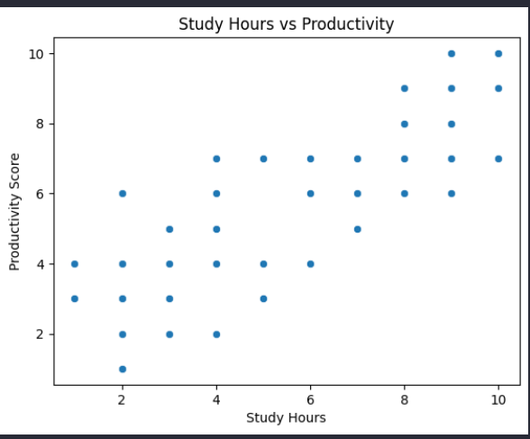
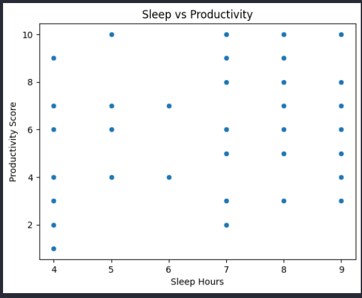
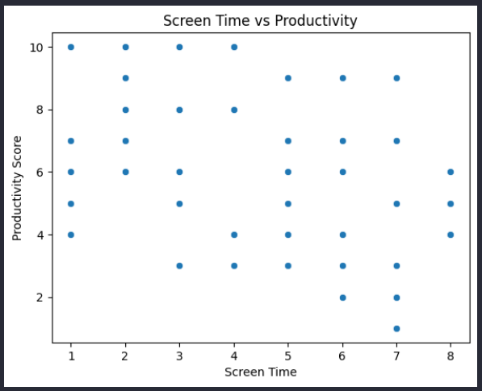

## CUSTOMER-CHURN-ANALYSIS ##

# Overview
Analyzed customer data using Python to identify key factors influencing customer churn and retention.

# Objectives
- Understand why customers leave
- Identify patterns affecting churn
- Provide actionable business insights

# Tools Used
- Python (Pandas, NumPy)
- Matplotlib, Seaborn
- Jupyter Notebook

# Key Steps
- Data cleaning and preprocessing
- Exploratory Data Analysis (EDA)
- Data visualization and pattern analysis

# Key Insights
- Customers with higher charges showed higher churn rate
- Service quality and pricing impacted customer retention
- Certain customer segments were more likely to churn

## Files
- churn_analysis.ipynb: Main analysis notebook
- data.csv: Dataset used
- 
## Visualizations

# Study Hours vs Productivity

# Sleep vs Productivity

# Screen Time vs Productivity

### Screen Time vs Productivity

